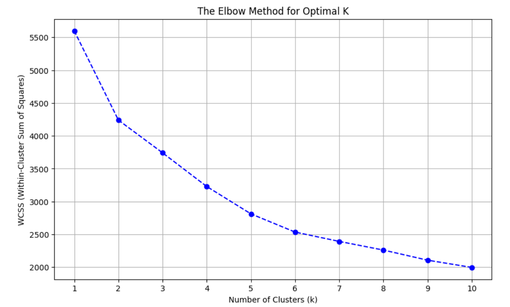
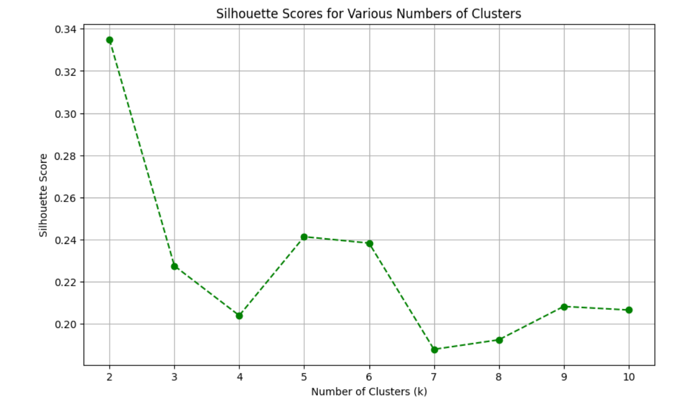
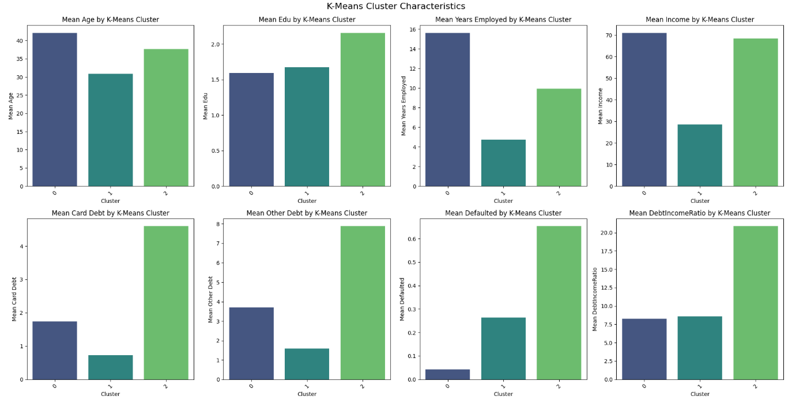
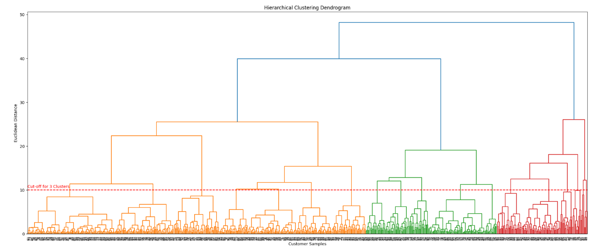

### **🚀 Customer Segmentation for Credit Card Marketing**

This project applies **unsupervised machine learning** to perform customer segmentation for a credit card company. By identifying distinct customer groups, this analysis provides a data-driven foundation for **highly targeted marketing strategies** and optimized product offerings.

---

### **🔍 Project Overview**

The primary objective is to move beyond a one-size-fits-all approach to customer engagement. We aim to categorize potential and existing customers into meaningful segments based on their financial behavior and demographic attributes. This enables the company to:

* Develop **personalized credit card products**.
* Enhance **customer acquisition** by targeting the most relevant audiences.
* Improve **customer retention** through tailored engagement.
* **Mitigate risk** by identifying high-risk profiles.

---

### **📊 Dataset & Features**

The analysis utilizes a comprehensive dataset containing various customer attributes:

* **Features:** Age, Education Level (`Edu`), Years Employed, Income, Card Debt, Other Debt, Default Status (`Defaulted`), and Debt-to-Income Ratio (`DebtIncomeRatio`).
* **Objective:** To uncover hidden patterns within customer data and group individuals with similar characteristics for strategic marketing and risk management.

---

### **⚙️ Key Techniques & Workflow**

This project follows a robust data science methodology:

1.  **Data Preprocessing:**
    * Initial cleaning: Handling `Unnamed: 0` and `Customer Id` columns.
    * Missing value treatment: Removing rows with missing 'Defaulted' values and addressing other inconsistencies.
    * **Feature Scaling:** Applying `StandardScaler` to ensure all features contribute equally to clustering algorithms, critical for distance-based methods.
2.  **K-Means Clustering:**
    * **Optimal 'k' Determination:** Employing the **Elbow Method** and **Silhouette Score** to identify the most appropriate number of clusters for effective segmentation.
    * Cluster Assignment & Analysis: Assigning customers to clusters and analyzing the mean characteristics of each segment to define unique profiles.
3.  **Hierarchical Clustering:**
    * **Dendrogram Visualization:** Constructing a dendrogram to visually represent the hierarchical relationships between data points and inform cluster selection.
    * Alternative Segmentation: Applying `AgglomerativeClustering` to confirm and refine the segments identified by K-Means.
4.  **Strategic Recommendations:** Translating the analytical findings into actionable business strategies for the credit card company, including targeted marketing campaigns and risk management approaches.

---

### **💡 Business Impact & Insights**

The clustering analysis reveals distinct customer segments, each with unique behavioral patterns and risk profiles:

* **Established & Debt-Prone Professionals:** High-income, high-debt individuals capable of managing their obligations – ideal for premium credit products.
* **Young & Financially Conservative:** Low-income, low-debt, zero-default individuals – prime candidates for introductory credit-building products.
* **High-Risk Defaulters:** Older, highly educated, but with a 100% default rate – requiring stringent risk mitigation and debt recovery strategies.

These insights enable a **precision-guided approach** to marketing, ensuring resources are allocated effectively and customer interactions are highly relevant, leading to improved profitability and customer satisfaction.

---

### **🖼️ Sample Visuals**

Here are some key visualizations from the customer segmentation analysis:


_Determining the optimal number of clusters for K-Means._


_Validating cluster quality with silhouette scores._


_Average feature values for each K-Means cluster._


_Visualizing the hierarchy of clusters._

[🔗View full notebook](Customer_Segementation_Analysis.ipynb)

---

### **🛠️ Installation**

To run this analysis locally, clone the repository and install the required dependencies:

```bash
git clone https://github.com/Elsie-Muhumuza/Customer_Segmentation_Analysis.git
cd Customer-Segmentation-Analysis
pip install -r requirements.txt

